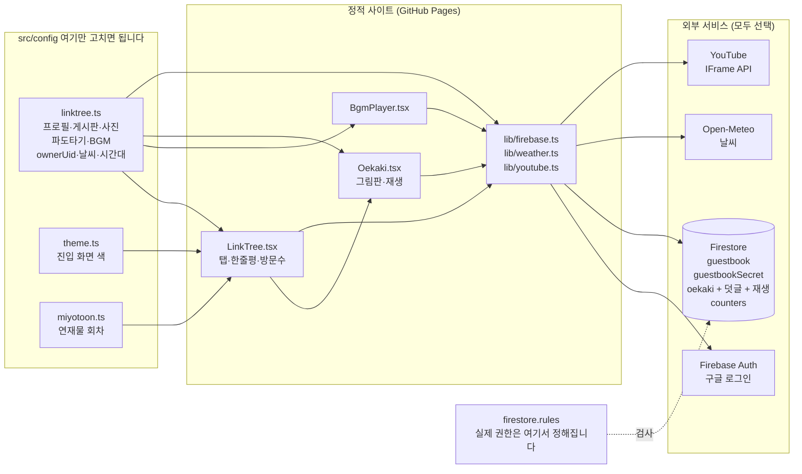
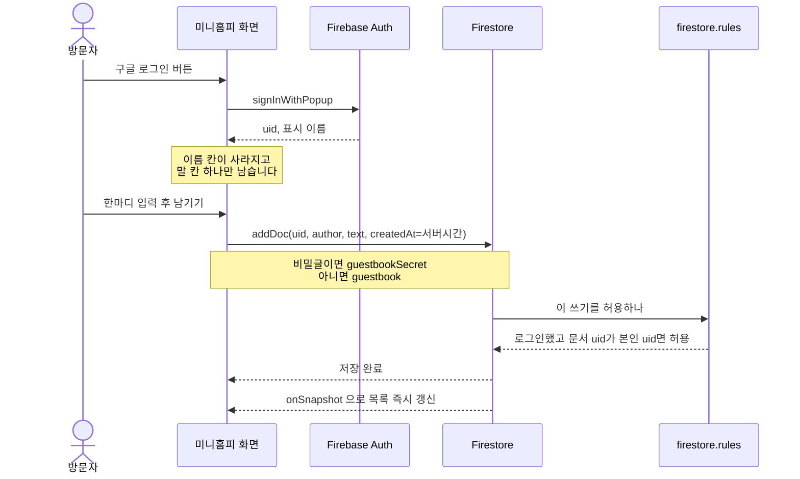
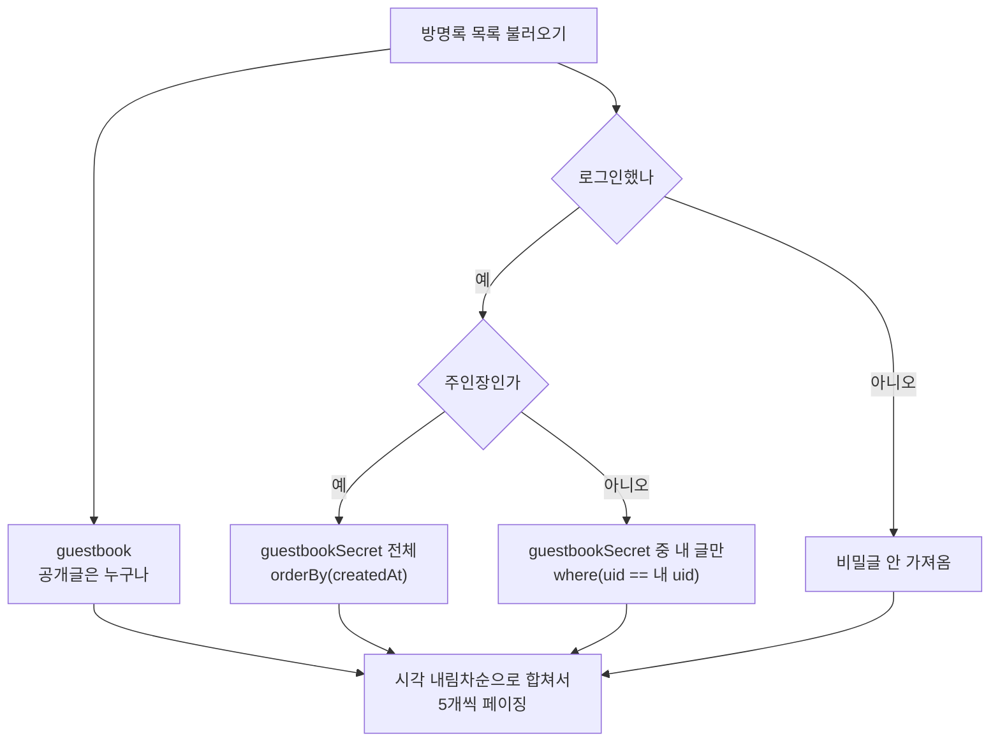

# 미니홈피 링크트리 제작 키트

DoRms 커뮤니티 구성원이 옛날 싸이월드 미니홈피 느낌의 링크트리를 만들어 자기 활동을 모아 공개할 수 있는 제작 키트입니다.

이 저장소는 DoRms 본 서비스가 아니라, 커뮤니티 구성원이 각자 포크해서 자기 것으로 채워 쓰는 디자인 껍데기입니다. 제품별 이미지나 내부 운영 자산은 넣지 않았고, DoRms 커뮤니티 대표 이미지와 고를 수 있는 SVG 아이콘만 포함했습니다.

## 담긴 기능

- 첫 화면 스파이럴 인트로에서 홈(미니룸, 한줄평)으로, 다시 탭별 콘텐츠로 이어지는 미니홈피 구조
- 왼쪽 프로필 사진, 미니룸 이미지, 자기소개 섹션(소개 글 / 하고 있는 일들 목록 / 연락처). 모두 내 것으로 교체
- 게시판 탭 (앱·글 등 링크 모음, 미리보기 이미지 지원, 탭 이름도 바꿀 수 있음)
- 연재물 탭 (웹툰처럼 화별로 이어지는 이미지 컷, 선택 기능. 안 쓰면 탭 자체가 숨겨짐)
- 낙서장 탭. 사진 목록과 오에카키가 함께 들어갑니다. 탭 이름은 바꿀 수 있고, 탭 버튼이 좁아 네 글자 이내가 좋습니다
- 왼쪽 아래 파도타기(자주 가는 곳) 목록. 첫 항목은 도름스 활동 링크로 고정
- 미니홈피 배경음악(BGM) 플레이어 (유튜브 영상 기반, 선택 기능)
- 왼쪽 위 날씨 (Open-Meteo, 키 없이 동작. 위치는 설정에서 바꿉니다)
- 왼쪽 위 TODAY / TOTAL 방문자 수 (하루 경계는 설정한 시간대를 따릅니다)
- `main`에 푸시하면 GitHub Pages에 자동 배포되는 워크플로 포함 (lint 검사 포함)

### 무겁지 않게 만든 것들

미니홈피는 남에게 보여 주려고 만드는 것이라 처음 열릴 때가 중요합니다. 재 보고 고친 것들입니다.

| | 전 | 후 |
|---|---|---|
| 첫 화면 JS | 1246KB | **693KB** (Firebase를 필요할 때 받습니다) |
| 낙서장 탭 데이터 | 929KB (18장 전부) | **약 5KB** + 보이는 5장 |
| 배포물 이미지 | 12MB | 237KB (WebP, 표시 크기의 2배까지) |

그림은 문서가 아니라 하위 문서에 둡니다. Firestore JS SDK에는 필드를 골라 받는 기능이 없어서, 문서 안에 이미지가 있으면 목록에 무조건 딸려옵니다.

Firebase를 연결하면 아래가 살아납니다. 연결하지 않으면 조용히 숨겨지고 나머지는 그대로 동작합니다.

**한줄평** (홈 탭 What friends say)

- 구글 로그인한 사람만 작성. 이름은 구글 프로필에서 자동으로 옵니다
- 비밀글 (주인장과 작성자 본인만 열람)
- 작성자 본인 수정·삭제, 주인장은 남의 글도 삭제
- 최신순, 5개씩 페이징, 실시간 반영

**오에카키** (낙서장 탭)

옛날 BBS의 그림 방명록입니다. 브라우저에서 바로 그려 남기고 서로 덧글을 답니다.

- 도구 여덟 가지: 펜, 직선, 사각형, 원, 채우기, 흐리게, 스포이드, 지우개
- 사각형과 원은 속까지 칠하는 채움을 켤 수 있습니다
- 색 24가지, 굵기 3단계, 농도 10~100%
- 레이어 최대 4장 (선택, 숨기기, 지우기)
- 되돌리기 15단계와 다시하기
- **그리는 과정 재생**. 선이 하나씩 그어지는 걸 되감아 봅니다
- 그림마다 덧글. 내 그림에 새 덧글이 달리면 목록에 표시됩니다
- 그림 하나를 링크로 공유할 수 있습니다 (`?tab=photo&draw=<id>`)
- 주인장은 그림을 가릴 수 있습니다. 화면에서만 감추는 게 아니라 규칙이 읽기를 막습니다

## 전체 구조

고칠 곳은 `src/config` 세 파일이고, 나머지는 그 값을 읽어 그리기만 합니다. Firebase는 연결하지 않아도 사이트가 그대로 동작합니다.



`NEXT_PUBLIC_FIREBASE_*` 를 비워 두면 `lib/firebase.ts` 가 조용히 꺼지고, 방명록은 `linktree.ts` 의 예시 글만 보여 줍니다.

### 방명록이 저장되는 과정



### 방명록을 누가 볼 수 있나

Firestore 규칙은 조회 결과를 걸러 주지 않습니다. 문서마다 달라지는 조건을 걸면 질의 자체가 거부되므로, 보는 사람에 따라 질의를 다르게 보냅니다.



## 빠른 시작

```bash
npm install
npm run dev
```

브라우저에서 `http://localhost:3000`을 엽니다.

## 내 것으로 바꾸기

가장 손이 덜 가는 방법은 AI 코딩 도구에 맡기는 것입니다. 아래 "AI에게 맡길 때"를 보세요.

직접 고치고 싶다면 아래 파일들을 순서대로 봅니다.

이 저장소를 처음 열면 원 저작자(미요Lab)의 사진·소개글·게시판 예시가 이미 채워져 있습니다. 그대로 두지 말고 내 것으로 바꾸세요.

1. `src/config/linktree.ts` : 표시 이름, 소개 문구, 프로필 사진·미니룸 이미지, 탭 이름(`profile.boardLabel`, `profile.photoLabel` 등), 자기소개 섹션, 게시판, 사진 목록, 파도타기, BGM, 한줄평 예시 글, 그리고 `ownerUid`·날씨 위치·기준 시간대가 여기 있습니다.
2. `src/config/miyotoon.ts` : 연재물(웹툰형) 탭을 쓸 때 회차와 컷 이미지 경로를 넣습니다. 안 쓰면 이 파일을 비워도 됩니다(탭이 자동으로 숨겨집니다).
3. `src/config/theme.ts` : 전체 색상을 바꿉니다. 여기 값이 CSS 변수로 화면에 심어지므로, 값만 고치면 진입 화면과 미니홈피 본문이 함께 바뀝니다. 회색 계열(테두리, 보조 글자)은 팔레트를 바꿔도 그대로 두는 편이 자연스러워 `globals.css` 에 남겨 두었습니다.
4. 왼쪽 아래 파도타기 목록의 첫 번째 항목인 `도름스 커뮤니티 나의 활동`은 항상 맨 위에 둡니다.
5. 프로필 사진·미니룸 이미지·게시판 미리보기·낙서장 사진은 `public/assets/` 안에 미리 넣어두고 그 경로를 config에 적습니다. 오에카키 그림은 방문자가 그리는 것이라 여기 넣지 않습니다.
6. 저장소 이름을 "meyo-lab"이 아닌 나만의 이름으로 정했다면 `package.json`의 `name`, `homepage`, `repository.url`도 맞춰 바꿉니다.
7. 배포 주소가 생기면 `.env.example`을 참고해 `.env.local`을 만들고 `NEXT_PUBLIC_SITE_URL`, (GitHub Pages라면) `NEXT_PUBLIC_BASE_PATH`를 설정합니다. GitHub Pages 자동 배포는 저장소 이름에 맞춰 알아서 계산되므로 보통은 그대로 두면 됩니다.

## 방명록·방문자 수를 실제로 움직이려면 (선택)

기본 상태에서는 방명록에 예시 글만 보이고 방문자 수도 늘어나지 않습니다. 실제로 쌓이게 하려면 Firebase 프로젝트를 하나 만들어 연결하세요.

방명록(한줄평)은 **구글 로그인한 사람만** 남길 수 있습니다. 이름 칸이 자유 입력이면 사칭을 막을 수 없어서, 이름은 구글 프로필에서 가져오고 문서에 계정 uid가 함께 남습니다. 로그인하지 않은 사람에게는 입력 칸 대신 작은 로그인 안내만 보입니다.

### 누가 무엇을 할 수 있나

| | 공개글 읽기 | 비밀글 읽기 | 쓰기 | 수정 | 삭제 |
|---|---|---|---|---|---|
| 로그아웃 | O | X | X | X | X |
| 로그인한 사람 | O | 자기 글만 | O | 자기 글만 | 자기 글만 |
| 주인장 | O | 전부 | O | 자기 글만 | **전부** |

오에카키도 같은 뼈대입니다.

| | 그림 보기 | 그리기 | 덧글 | 삭제 | 가리기 |
|---|---|---|---|---|---|
| 로그아웃 | O | X | X | X | X |
| 로그인한 사람 | O | O | O | 자기 것만 | X |
| 주인장 | O + 가려진 것 | O | O | **전부** | **O** |

그림은 고칠 수 없습니다. 지우고 다시 그립니다. 가려진 그림은 화면에서만 숨는 게 아니라 규칙이 읽기 자체를 막습니다. 주소를 알아도 못 봅니다.

그림은 Firebase Storage 가 아니라 Firestore 문서에 data URL 로 담습니다. Storage 를 새로 켜려면 요금제를 올려야 하는 경우가 있는데, 360x360 그림 한 장이 12KB 라 문서 한도 1MiB 의 1.2% 밖에 안 됩니다. 컬렉션 하나만 늘리면 되어 설정 절차가 늘지 않습니다.

주인장에게 **수정** 권한은 주지 않았습니다. 남이 한 말의 내용을 바꾸면 그 사람이 하지 않은 말이 그 사람 이름으로 남습니다. 부적절한 글은 지우는 것으로 충분합니다.

이 표는 `firestore.rules` 가 강제합니다. 화면의 버튼 표시는 편의일 뿐이라, 규칙을 배포하지 않으면 실제로는 막히지 않습니다.

### 주인장 지정

비밀글을 볼 주인장은 `src/config/linktree.ts` 의 `ownerUid` 와 `firestore.rules` 의 `ownerUid()` **두 곳**에 같은 값으로 적어야 합니다. 값은 Firebase 콘솔의 Authentication > Users 에서 확인합니다.

한쪽만 고치면 비밀글이 공개되거나 주인장도 못 봅니다. `ownerUid` 를 빈 문자열로 두면 비밀글 체크박스가 아예 나오지 않습니다.

### 설정 절차

1. [Firebase 콘솔](https://console.firebase.google.com)에서 프로젝트를 만듭니다.
2. **Authentication → Sign-in method** 에서 **Google** 을 사용 설정합니다.
3. **Authentication → Settings → 승인된 도메인** 에 배포 주소의 도메인을 추가합니다. GitHub Pages라면 `<내 아이디>.github.io` 입니다. 로컬 개발용 `localhost` 는 기본으로 들어 있습니다.
   - 이 단계를 빼먹으면 배포된 사이트에서 로그인 팝업이 `auth/unauthorized-domain` 으로 막힙니다.
4. **Firestore Database** 를 만듭니다.
5. 프로젝트 설정에서 **웹 앱**을 등록하고 config 값 6개를 받아옵니다.
6. `.env.example` 을 참고해 `.env.local` 에 `NEXT_PUBLIC_FIREBASE_*` 6개를 채웁니다.
7. GitHub Pages로 배포한다면 같은 값 6개를 저장소의 **Settings → Secrets and variables → Actions** 에 같은 이름으로 넣습니다. `deploy.yml` 이 알아서 씁니다.
8. `firestore.rules` 를 그 프로젝트에 배포합니다.

```bash
npx firebase-tools deploy --only firestore:rules
```

Firebase 웹 설정값은 비밀키가 아니라 프로젝트 식별자입니다. 배포된 JS에 그대로 노출되는 것이 정상이며, 실제 접근 제한은 `firestore.rules` 가 담당합니다. 이 값을 채우지 않으면 그냥 예시 데이터로 조용히 동작합니다.

## AI에게 맡길 때

가장 쉬운 방법: 포크할 필요 없이, 이 저장소 링크를 그대로 쓰고 있는 AI 코딩 도구에 주면서 이렇게만 말하세요.

> 이 깃허브 저장소로 내 미니홈피 링크트리를 만들고 싶어: https://github.com/Pcallpang/meyo-lab . `docs/AI_CUSTOMIZE_PROMPT.md`를 읽고 그대로 진행해줘.

파일을 직접 열어보거나 내용을 복사해서 붙여넣을 필요 없이, AI가 알아서 다음을 진행합니다.

1. 아직 자기 것으로 복사되지 않았다면 GitHub CLI로 새 이름으로 포크
2. 질문에 답하거나, 미리 채워둔 [docs/나만의-링크트리-양식.md](docs/나만의-링크트리-양식.md)를 반영해서 코드 수정 (원 저작자의 예시 콘텐츠는 지우고 내 것으로 교체)
3. 빌드 확인, GitHub Pages 배포
4. 완성된 내 미니홈피 주소를 마지막으로 알려줌

이 저장소에는 `AGENTS.md`, `CLAUDE.md`, `.github/copilot-instructions.md`도 들어 있어서, Claude Code처럼 저장소를 직접 열어 쓰는 도구는 별다른 안내 없이도 규칙을 자동으로 따릅니다.

## 원본 키트에서 고친 것들 (다른 포크에 가져가려면)

이 저장소는 원본 키트([Pcallpang/meyo-lab](https://github.com/Pcallpang/meyo-lab))를 포크한 뒤 여러 가지를 고쳤습니다. 규칙 파일 문법 오류, 이미지 용량, 접근성, 방명록 개편 같은 것들입니다.

원본에 PR로 보내는 대신, 다른 포크에서 필요한 것만 골라 가져갈 수 있도록 [docs/키트-개선-내역.md](docs/키트-개선-내역.md)에 정리해 두었습니다. AI 코딩 도구에 그 문서를 읽히면 알아서 적용합니다.

> 내 미니홈피에 이 개선 사항을 적용하고 싶어: https://github.com/progh2/mini-homepage/blob/main/docs/키트-개선-내역.md . 이 문서를 읽고 A묶음만 적용해줘.

두 묶음으로 나눠 두었습니다.

- **A묶음** 설정 작업 없이 바로 적용할 수 있고 기존 동작을 깨지 않습니다. 원본 키트를 쓰는 누구에게나 이득입니다.
- **B묶음** 방명록을 구글 로그인 기반으로 바꾸는 개편입니다. **깨지는 변경**이라 원하는 사람만 적용하세요. 익명으로 편하게 남기는 게 미니홈피 감성이라고 보면 안 가져가는 편이 낫습니다.

## 반드시 지키는 기본값

- 왼쪽 아래 파도타기 목록의 첫 번째 항목은 `도름스 커뮤니티 나의 활동`입니다.
- 연재물, BGM, 낙서장 사진, 파도타기 추가 링크, Firebase 연동(한줄평·오에카키·방문 수)은 모두 선택 기능이며, 안 쓰면 빈 배열로 두면 화면에서 알아서 사라집니다.
- 이 템플릿에는 여러 링크를 한 화면에 모아 보여주는 메인 링크 카드 목록 기능이 없습니다.
- 개인 정보, 비공개 링크, 서비스 내부 자산, 환경변수는 커밋하지 않습니다.

## 배포

GitHub Pages로 정적 배포하도록 `next.config.ts`가 `output: "export"`로 설정돼 있습니다.

```bash
npm run build
```

빌드가 통과하면 `out/` 폴더를 GitHub Pages, Vercel, Netlify, Cloudflare Pages 같은 정적 호스팅에 올릴 수 있습니다.
